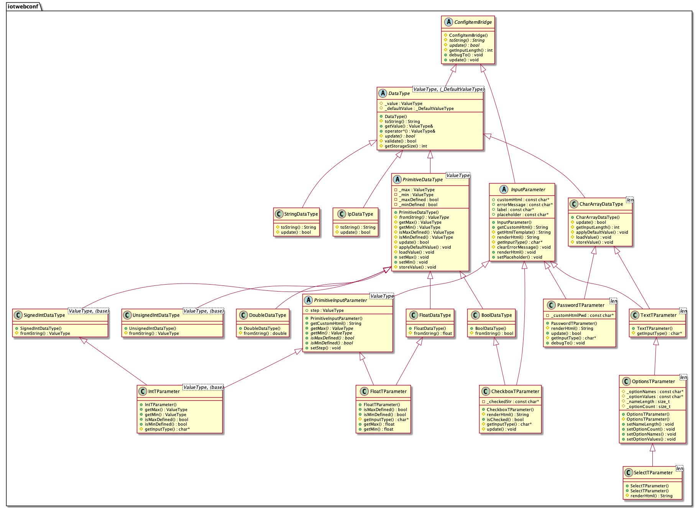

# IotWebConf hacking guide

IotWebConf comes with a lot of examples. These examples are intended
to be easy to use, with clear goals. While IotWebConf is also ment to be
developer friendly, providing lots of customization options.
 
This documentation will try to explain features where you can customize
IotWebConf on your need, or where a feature explanation might be out of the
scope of regular examples.

Please note, that header files are full of
documentation, so please heavily consult ```IotWebConf.h``` header file
while/beside reading this documentation. 

__Contents__:

  - [PlatformIO](#using-iotwebconf-with-platformio)
  - [Compile time configuration](#compile-time-configuration)
  - [Groups and Parameters](#groups-and-parameters)
  - [Optional and chained groups](#optional-and-chained-groups)
  - [Using System parameter-group](#using-system-parameter-group)
  - [Alternative WiFi connection](#alternative-wifi-connection)
  - [Accessing system properties](#accessing-system-properties)
  - [Use custom style](#use-custom-style)
  - [Create your property class](#create-your-property-class)
  - [Typed parameters](#typed-parameters-experimental)
  - [Control on WiFi connection status change](#control-on-wifi-connection-status-change)
  - [Use alternative WebServer](#use-alternative-webserver)

## Using IotWebConf with PlatformIO
It is recommended to use PlatformIO instead of the Arduino environment.

With v3.0.0, a folder ```pio``` is provided with scripts that transforms
examples to PlatformIO compatible format. You can use these as templates
for your project. (On the other hand, these scripts creating soft-link
loops, and having soft link loops in these folders might cause Arduino
and other environment to fail. Just keep in mind, if something goes
wrong with your IDE, then examples-pio is likely the corporate.)

## Compile time configuration
IotWebConf includes a configuration file named IotWebConfSettings.h.
This configuration file works on C pre-compiler mechanism. This means
you cannot use it in Arduino environment, so I encourage everyone to
switch to PlatformIO.

In the PlatformIO you can do configuration changes by adding lines to
 platformio.ini like this:
```
build_flags =
  -DIOTWEBCONF_DEFAULT_WIFI_CONNECTION_TIMEOUT_MS="60000"
  -DIOTWEBCONF_DEBUG_DISABLED
```

**Note:** You must not use ```#define IOTWEBCONF_CONFIG_START 20```, or
simmilar defines in your .ino file (e.g. before the includes). It will eventually
just not work, as all .cpp files are compiled separately for each other.
Thus, you must use the ```-D``` compiler flag for the job.

## Groups and Parameters
With version 3.0.0 IotWebConf introduces individual parameter classes for
each type, and you can organize your parameters into groups.
You can also free to add groups into groups to make a tree hierarchy. 

## Optional and chained groups
With ```OptionalParameterGroup```, the group you have defined will have
a special appearance in the config portal, as the fieldset in which the
group items are shown can be hidden (inactive) / shown (active).

E.g you want to create a group with property items, that are not mandatory,
so you can hide these options in the config portal by default, and
only reveal the contents, when it is strictly requested.
There is a specific example covering this very feature under
```IotWebConf13OptionalGroup```.

```ChainedParameterGroup```s can be linked. One after another. The
property sets will reveal on after another, when user requests is. The
difference between ```OptionalParameterGroup``` and ```ChainedParameterGroup```
is that second group item in a chained list can only be added, when
the first item is already visible.
There is a specific example covering this very feature under
```IotWebConf14GroupChain```.

## Using system parameter-group
By default, you should add your own parameter group, that will appear as
a new field-set on the Config Portal. However, there is a special group
maintained by IotWebConf called the System group, where you are also
allowed to add your own custom properties.

Example:
```
  iotWebConf.addSystemParameter(&stringParam);
```

You can directly access system-parameter group by calling
```getSystemParameterGroup()```.

Example:
```
  ParameterGroup* systemParameters = iotWebConf.getSystemParameterGroup();
  systemParameters.label = "My Custom Label";
```

There is another group "WiFi parameters" managed by IotWebConf, that
can be retrieved by getWifiParameterGroup().

## Alternative WiFi connection
With v3.0.0 you can set up multiple WiFi connection by utilizing the
MultipleWifiAddition class can be found in IotWebConfMultipleWifi.h .

This class basically set up some handlers in iotWebConf to
1. display optional WiFi settings in admin GUI,
2. use these alternative settings in case previous WiFi connection
attempts fails.

The maximal number of connection settings are determined compile-time,
as we want to avoid any dynamic memory allocations in Arduino.

There is a complete example covering this topic, please visit example
```IotWebConf15MultipleWifi```!

## Accessing system properties
IotWebConf comes with some parameters, that are required for the basic
functionality. You can retrieve these parameter by getters, e.g.
```getThingNameParameter()```. You can directly modify these items as
seen in the code block below.
 
There is a dedicated example covering this topic, so please visit
example ```IotWebConf11AdvancedRuntime```!

```
    // -- Update Thing name
    strncpy(
      iotWebConf.getThingNameParameter()->valueBuffer,
      "My changed name",
      iotWebConf.getThingNameParameter()->getLength());
    iotWebConf.saveConfig();
```

Here is list of some of the system parameter-acccessors, please consult
IotWebConf.h for further details.
- getSystemParameterGroup()
- getThingNameParameter()
- getApPasswordParameter()
- getWifiParameterGroup()
- getWifiSsidParameter()
- getWifiPasswordParameter()
- getApTimeoutParameter()

## Use custom style
You can provide your own custom HTML template by updating default
HTML format provider. For this you should utilize the
 ```setHtmlFormatProvider()``` method.

There is a complete example about this topic, so please visit example
```IotWebConf10CustomHtml```!

## Create your property class
With version 3.0.0 you are free to create your own property class.
It is done by inheriting the iotwebconf::Parameter C++ class. You can use
other property types e.g. PasswordProperty as a template for this.

Now, custom properties are mainly handy, when you would like to create
some special HTML form item. But eventually you can change the whole
behaviour of your parameter handling. E.g. by overriding ```storeValue()```
and ```loadValue()``` you can basically convert your internal data format
to whatever you like. The [Typed parameters](#typed-parameters-experimental)
approach is just an excelent example for this option.

You can also override ParameterGroup class in case you need some special
group appearance.

There is a complete example about this topic, so please visit example
```IotWebConf12CustomParameterType```!

## Typed parameters (experimental)
A new parameter structure is introduced, where the parameters does not
require a "valueBuffer" anymore. Storing the parameter is done in a
native format, e.g. a 8-bit integers are stored in one byte of EEPROM.
 
This was achieved by utilizing the ```template``` technology of C++.
While the result is spectacular, the ```template``` makes thing very
complicated under the hood.

Builder pattern is also introduced for the typed parameters. See example
```IotWebConf03TypedParameters``` for details. Please compare example
IotWebConf03TypedParameters and IotWebConf03TypedParameters for the
difference in the usage of the two different approach.

**Please note, that Typed Parameters are very experimental, and the
interface might be a subject of change in the future.**


(This image was created by PlantUML, the source file is generate with command
```hpp2plantuml -i src/IotWebConfTParameter.h -o doc/TParameter.plantuml```)

## Control on WiFi connection status change
IotWebConf provides a feature to control WiFi connection events by defining
your custom handler event handler.

With ```setWifiConnectionFailedHandler()``` you can set up a handler, that
will be called, when a connection to a WiFi network failed (most likely
timed out). Now, when you return with a new valid connection-info from
your callback, IotWebConf will not fall back to AP mode, but try the
connection you have just provided. With this method you can theoretically
set up multiple WiFi networks for IotWebConf to try connect to after
one-by-one if the previous one fails. Some days IotWebConf might also
provide this feature out of the box.

There is a second method, where you can define a specific handler, this
is the ```setWifiConnectionHandler()```. Your method will be called when
IotWebConf trying to establish connection to a WiFi network.

For details please consult ```IotWebConf.h``` header file!

## Use alternative WebServer

There was an expressed need from your side for supporting specific types of
Web servers. (E.g https
web server or async web server.) So, with v3.0.0 there is an option to
use web server of your choice. To achieve this, you will call IotWebConf
constructor, that accepts a ```WebServerWrapper``` pointer.
In the WebServerWrapper you have the implement all expected web server
functionalities (as seen in the header file). You can use
the ```StandardWebServerWrapper``` as a template for that.

Further more, you also need to provide your custom ```WebRequestWrapper```
instances when calling ```handleCaptivePortal()```, ```handleConfig()``` and
```handleNotFound()```.

Unfortunately I currently do not have the time to implement solutions
for Async Web Server os Secure Web Server. If you can do that with the
instruction above, please provide me the pull request!
